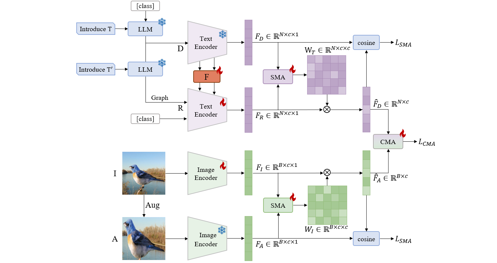

# Fine-Tuning via Linked Domains: A Closed-Form <u>D</u>ual Alignment Mechanism for Transferring Vision-Language Models
## Approach

> **<p align="justify"> Abstract:** *Adapters and prompt learning have become two de facto strategies to fine-tune pre-trained vision-language models, mitigating the high computational cost of fine-tuning an entire model for downstream tasks. They can align the prediction from the fine-tuned model with that from the pre-trained model. However, the existing methods of these strategies primarily focus on aligning within a single modality, and the exploration of bidirectional interactions between modalities remains limited. To address this issue, we propose a closed-form dual alignment mechanism (DAM) that not only ensures the consistency in predictions within a single modality but also achieves the alignment of features across different modalities. In DAM, all alignments are achieved by closed-form solutions to ridge regression, without inducing a massive number of learnable parameters. Experimental results demonstrate that DAM outperforms the state-of-the-art methods on 11 benchmarks over various evaluation metrics.* </p>

## Contributions
- We introduce a dual alignment mechanism (DAM) that guarantees both the same-modal prediction consistency and the cross-modal alignment.
- We develop a bidirectional cross-alignment scheme that seamlessly connects text and image modalities through both text-to-image and image-to-text projections.
- We implement all alignments using ridge regression with closed-form solutions, ensuring stable and efficient feature transformation.

## Installation
```bash
# Create a conda environment
conda create -n dam python=3.8

# Activate the environment
conda activate dam

# Install torch (requires version >= 1.8.1) and torchvision
# Please refer to https://pytorch.org/ if you need a different cuda version
pip install torch==1.10.1+cu111 torchvision==0.11.2+cu111 torchaudio==0.10.1 -f https://download.pytorch.org/whl/cu111/torch_stable.html

# Clone this repo
git clone https://github.com/KaiyangZhou/Dassl.pytorch.git
cd Dassl.pytorch/

# Install dependencies
pip install -r requirements.txt

# Install this library (no need to re-build if the source code is modified)
python setup.py develop
cd ..

git clone https://github.com/Peiy-Lu/DAM.git

cd DAM-main/

# Install requirements
pip install -r requirements.txt
```

## Datasets
For datasets, please follow the CoOp instructions here: [DATASETS.md](https://github.com/KaiyangZhou/CoOp/blob/main/DATASETS.md).

## How to Run
We have designed execution scripts for each task to help you reproduce the results of our paper.

### Base-to-New Generalization
First, you need to set the DATA variable in the `./scripts/b2n_train.sh` and `./scripts/b2n_test.sh` files to your dataset path.

For convenience, we have included all three seeds for each dataset in a single script file named b2n_all.sh. You can reproduce our results by simply running the following code:
```bash
bash ./scripts/b2n_all.sh
```
If you need to reproduce results for a single dataset, seed, or shot, you can simply run the script as follows:
- Train and Test on Base Classes: `bash scripts/b2n_train.sh dataset seed shot gpu`
- Test on New Classes：`bash scripts/b2n_test.sh dataset seed shot gpu`

### Domain Generalization & Cross-dataset Evaluation
Similarly, we provide a script named `./scripts/xd_all.sh` for Domain Generalization and Cross-dataset Evaluation, which enables the training and testing of all datasets with three seeds in a single run.

If you need to reproduce the performance of a single dataset, you will need to follow the steps below to run the script:
- Training on ImageNet: `bash ./scripts/xd_train.sh gpu`
- Test on New Dataset for Domain Generalization: `bash ./scripts/xd_test_dg.sh dataset seed gpu`
- Test on New Dataset for Cross-dataset Evaluation: `bash ./scripts/xd_test_cde.sh dataset seed gpu`

## Results
### Base-to-New Generalization
The table presents the performance of DAM on 11 recognition datasets under the base-to-new generalization setting. The best results are highlighted in bold. This demonstrates that our dual alignment mechanism excels not only in same-modal feature alignment but also in effectively handling cross-modal feature alignment, thus enhancing the model's generalization capability on new classes.
| Name                                       |   Base Accuracy   |   New Accuracy    |   Harmonic Mean   |
| ------------------------------------------ | :---------------: | :---------------: | :---------------: |
| [CLIP](https://arxiv.org/abs/2103.00020)   |       69.34       |       74.22       |       71.70       |
| [CoOp](https://arxiv.org/abs/2109.01134)   |       82.69       |       63.22       |       71.66       |
| [CoCoOp](https://arxiv.org/abs/2203.05557) |       80.47       |       71.69       |       75.83       |
| [MaPLe](https://arxiv.org/abs/2210.03117)  |       82.28       |       75.14       |       78.55       |
| [HPT](https://arxiv.org/abs/2312.06323)    |       84.32       |       76.86       |       80.23       |
| [CAM](https://github.com/Peiy-Lu/DAM-main/)    |     **84.53**     |     **78.12**     |     **81.20**     |

### Cross-Dataset Evaluation
Performance of DAM on cross-dataset evaluation, i.e. the models are trained on ImageNet and evaluated on other
10 datasets with potentially different distribution.


### Domain Generalization
The comparison performances on domain generalization with existing methods are summarized in the table.


### Plug-in Performance of CMA
As shown in the table, our method improved the average performance across these eleven datasets by 0.51\% compared to CLIP.

